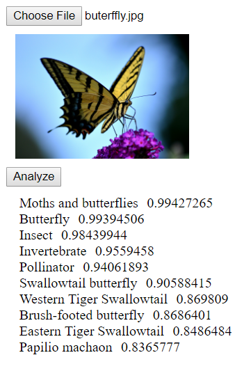

# Google vision API demo
## WMDD4950 Assignment 4

# How to run

```
   npm install -g lite-server
```

Then you simply run ```lite-server``` in the current directory.  The live version can be see at
[https://env3d.github.io/oauth-vision-api-tutorial/](https://env3d.github.io/oauth-vision-api-tutorial/)


